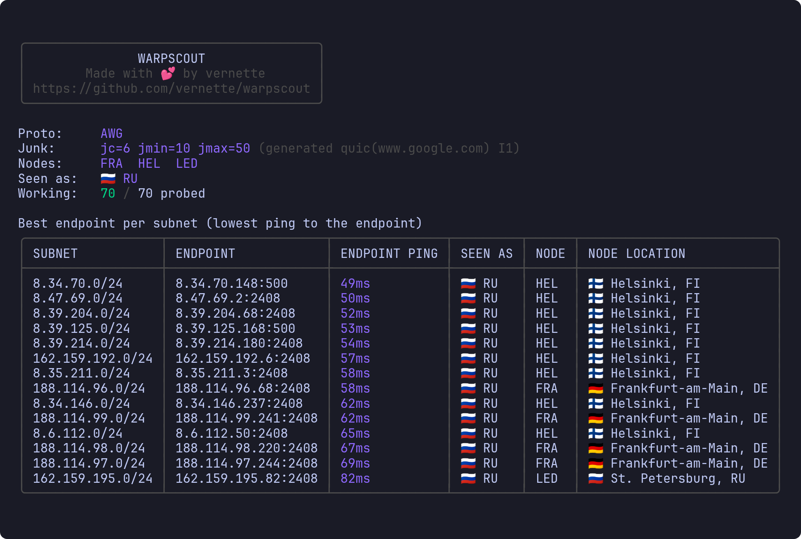
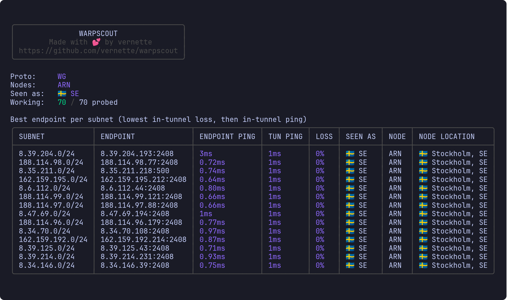
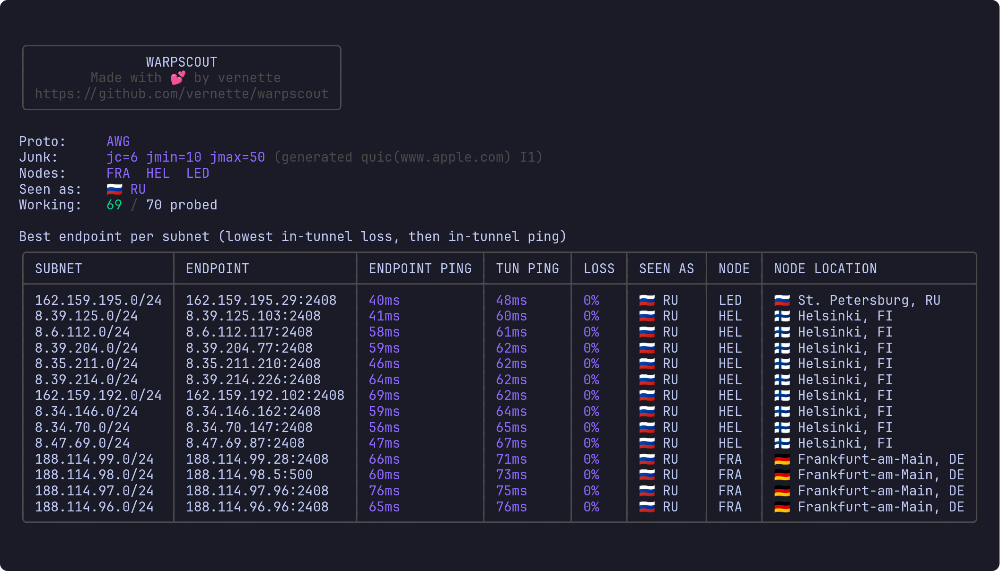

<h1 align="center">WARPSCOUT</h1>



<p align="center">Find Cloudflare WARP endpoints that work from your network, and see where they come out.</p>

<p align="center">
  <a href="https://github.com/vernette/warpscout/releases"></a>
  <a href="https://github.com/vernette/warpscout/actions/workflows/release.yaml"></a>
  <a href="https://github.com/vernette/warpscout/actions/workflows/test.yaml"></a>
  <a href="https://hub.docker.com/r/vernette/warpscout"></a>
  <a href="LICENSE"></a>
</p>

<p align="center">Documentation: 🇬🇧 English &middot; <a href="README_RU.md">🇷🇺 Русский</a></p>

## Table of contents

- [What it is](#what-it-is)
- [How it works](#how-it-works)
- [Install](#install)
- [Usage](#usage)
- [Scripting](#scripting)
- [AmneziaWG obfuscation](#amneziawg-obfuscation)
- [MASQUE](#masque)
- [Docker](#docker-1)
- [Troubleshooting](#troubleshooting)
- [Credits](#credits)

## What it is

Cloudflare WARP hands out thousands of endpoint addresses, and there is no built-in way to choose where your tunnel comes out. WARPSCOUT tries those addresses one by one and, for each of them, shows which country the traffic appears to come from and which Cloudflare edge node the tunnel landed on. Latency and packet loss are measured along the way, so among the well-placed endpoints you can also pick a fast one.

### Why the edge node matters

Choosing the node is what this tool was written for. Since April 2026, traffic going through the Moscow node (`DME`) is filtered by DPI inside Russia: some sites and services simply do not load through it, even though WARP itself connects fine. The same config, pointed at an endpoint with a different node, works without that problem.

There is no such setting in the official WARP client. The node depends both on where you are and on the endpoint address you connect to, so there is only one way to choose it: test addresses from your own connection and look at where they land. That is what WARPSCOUT does, and what `-node` and `-country` exist for: scan, keep only the endpoints that miss the unwanted node, export a config for the best of them.

### Checking what region a server gets

The other common case is a VPS. WARP determines the region from the address a connection comes from, and the GeoIP databases behind that decision are often wrong: a machine physically standing in the Netherlands can be filed as Indian, and every site the tunnel reaches will treat it that way.

A scan on the server answers that question right away, with the `SEEN AS` column. There is no need to set WARP up and find out afterwards that half your services have moved to another country.

How much the result tells you depends on where the server sits. On most European providers every address lands on the same node with the same region, and the scan fits on one screen:



Russian providers are less predictable: one machine gives you `ARN`, another `HEL`, and some hand out four locations or more across the pools, where there is an actual choice to make:



Two protocols are supported: plain WireGuard (`wg`) and AmneziaWG (`awg`), an obfuscated version of WireGuard that gets through networks where plain WireGuard is filtered.

- One static binary
- No root and no TUN device - the tunnel runs in userspace
- Linux, macOS, Windows and Docker, on `amd64` and `arm64`
- Live table while it scans, plus a report file that is easy to process (with `awk`, for example)

## How it works

A scan runs in two phases.

**Phase 1 - which ports get through.** WARP endpoints listen on several UDP ports and stay silent in response to everything except a valid WireGuard handshake. A completed handshake is therefore the only reliable test of whether a port is reachable. WARPSCOUT takes a few addresses and finds out which ports the network lets out. The common ones are tried first, and only if none of them get through are the rest swept.

**Phase 2 - where each endpoint comes out.** For every address a real tunnel is brought up, and `https://speed.cloudflare.com/meta` is requested through it. That one answer has everything needed:

- `SEEN AS` - the country other websites consider you to be in
- `NODE` - the Cloudflare edge node the tunnel landed on, as an airport code
- `NODE LOCATION` - the city and country of that node

Latency is measured in the same phase: the endpoint address is pinged from the host (`ENDPOINT PING`), and with `-tun-ping` the round-trip time and packet loss inside the tunnel are measured as well (`TUN PING`, `LOSS`).

The exit region and the node location are different things. A tunnel can go through Frankfurt and still come out as Russia. `SEEN AS` answers the question of which region websites see. `NODE` matters when it comes to latency, or to which filtering the traffic passes through on the way out: a node inside a censored country can drop or slow down what the same account carries fine through a node abroad.

Keep in mind that a single `/24` subnet can hand out several different edge nodes, and even neighbouring addresses sometimes differ. Assuming that a subnet equals a location does not work.

## Install

### One command (Linux, macOS, OpenWrt)

With curl:

```sh
curl -fsSL https://raw.githubusercontent.com/vernette/warpscout/master/install.sh | sh
```

With wget (OpenWrt routers have no curl by default):

```sh
wget -qO- https://raw.githubusercontent.com/vernette/warpscout/master/install.sh | sh
```

It picks the archive for your system and puts `warpscout` into `~/.local/bin`, or into `/usr/bin` on OpenWrt. Running it again is also how you update.

The script takes options after `sh -s --`, and `INSTALL_DIR` picks another directory:

```sh
INSTALL_DIR=/usr/local/bin sh -c "$(curl -fsSL https://raw.githubusercontent.com/vernette/warpscout/master/install.sh)"

curl -fsSL https://raw.githubusercontent.com/vernette/warpscout/master/install.sh | sh -s -- --version v0.8.1
curl -fsSL https://raw.githubusercontent.com/vernette/warpscout/master/install.sh | sh -s -- --uninstall
```

### Download a binary

Open the newest release on the [Releases page](https://github.com/vernette/warpscout/releases). There is one archive per OS, pick yours:

| Your OS                               | File                  |
| ------------------------------------- | --------------------- |
| Windows                               | `windows_amd64.zip`   |
| Mac with Apple silicon                | `darwin_arm64.tar.gz` |
| Mac with an Intel processor           | `darwin_amd64.tar.gz` |
| Linux, ordinary PC or server          | `linux_amd64.tar.gz`  |
| Linux on ARM (Raspberry Pi, some VPS) | `linux_arm64.tar.gz`  |

**Linux and macOS.** Unpack the archive and make the file executable:

```sh
tar xzf warpscout_*.tar.gz
chmod +x warpscout
./warpscout register
```

> [!NOTE]
> **macOS only.** The first run is blocked because the file was downloaded from the internet. Clear that flag once:
>
> ```sh
> xattr -d com.apple.quarantine warpscout
> ```

**Windows.** Unpack the `.zip`, open PowerShell or Command Prompt in the folder with the unpacked file (right-click the folder while holding Shift, then Open PowerShell/CMD here) and run:

PowerShell:

```powershell
.\warpscout.exe register
```

CMD:

```cmd
warpscout.exe register
```

### Build it yourself

With Go 1.25 or newer:

```sh
go install github.com/vernette/warpscout@latest
```

### Docker

```sh
# Register WARP account
docker run --rm -it --user "$(id -u):$(id -g)" -v "$PWD:/data" vernette/warpscout register

# Plain WireGuard scan
docker run --pull always --rm -it --user "$(id -u):$(id -g)" -v "$PWD:/data" vernette/warpscout scan

# AmneziaWG scan
docker run --pull always --rm -it --user "$(id -u):$(id -g)" -v "$PWD:/data" vernette/warpscout scan -p awg
```

See [Docker](#docker-1) for what the flags are for.

## Usage

WARPSCOUT has four commands. Run `warpscout <command> -h` for the full flag list of any of them.

| Command     | What it does                                             |
| ----------- | -------------------------------------------------------- |
| `register`  | Create a WARP account and save it. Start with this.      |
| `scan`      | Scan endpoints and report the working ones.              |
| `find-junk` | Search for AmneziaWG settings that get through a filter. |
| `version`   | Print the installed version on a line of its own.        |

### Step 1: register

Every scan needs a WARP account, so this is where to start:

```sh
warpscout register
```

The command writes `warpscout-account.json` into the current directory. Without that file `scan` and `find-junk` will not run. `-a/-account FILE` puts the file somewhere else, and the same flag tells `scan` where to look.

#### How registration works

WARPSCOUT does what the official WARP client does on first launch: it registers a new device with Cloudflare and gets a WireGuard peer for it.

1. A fresh X25519 keypair is generated locally. The private half stays on the machine the tool runs on.
2. The public half goes to `https://api.cloudflareclient.com/v0a4005/reg`, pretending to be the Android client. The answer carries an account `id`, a bearer token and the WARP peer's public key.
3. A second request switches WARP on for that account (`warp_enabled: true`).
4. The result is written to the account file:

```json
{
  "id": "...",
  "token": "...",
  "private_key": "...",
  "peer_public_key": "..."
}
```

| Field             | What it is                                                                                       |
| ----------------- | -------------------------------------------------------------------------------------------------- |
| `id`              | The account Cloudflare created. Addresses later requests.                                        |
| `token`           | The bearer token that authorises them. Both are secrets.                                         |
| `private_key`     | Your side of the tunnel. Also what ends up in `-conf` configs.                                   |
| `peer_public_key` | The WARP peer's public key - shared by every endpoint, so one account covers them all.           |

#### Running register again

On a second run the `id` and `token` are taken from the file and only the keys change: a new keypair is generated and sent as a `PATCH`, so a new `private_key` appears without burning another registration. A brand-new account is created in two cases - with `-fresh`, which ignores the file outright, and after a failed rotation (a revoked token, an account deleted on Cloudflare's side).

#### When the API is unreachable

Normally this is a simple process of two requests. On a filtered network those requests do not get out at all.

WARPSCOUT first checks whether `api.cloudflareclient.com` answers. If it does not, it registers _through_ a WARP tunnel: it goes over endpoint addresses, brings up a tunnel to the first one that completes a handshake, and sends the same registration requests through it. AmneziaWG is tried first, then plain WireGuard, and for AmneziaWG a few different first packets (`I1`) are cycled through as well, until one gets past the filter.

If a proxy is available, `-x/-proxy` sends the registration through it and the tunnel fallback is not used at all:

```sh
warpscout register -x socks5://127.0.0.1:1080
```

### Step 2: scan

```sh
warpscout scan -p awg
```

`-p/-proto` picks the protocol: `wg` (the default), `awg` or `masque`. On networks that filter VPN traffic, plain `wg` usually fails everywhere, so reach for `awg` or `masque` straight away, see [MASQUE](#masque).

If `-p awg` turns up no working endpoint, the next thing to change is the fake first packet (`I1`), not the junk parameters:

```sh
warpscout scan -p awg -gen-i1 quic
```

A filter that lets the handshake through and then kills the tunnel is indistinguishable from an unreachable endpoint, and a different `I1` is usually the cure - see [AmneziaWG obfuscation](#amneziawg-obfuscation). [`find-junk`](#step-3-find-junk-only-if-things-are-blocked) is only up next when none of the `-gen-i1` profiles helped.

Results are sorted by packet loss first, then by ping, so the top row is the best endpoint. Useful flags:

| Flag                | What it does                                                                                                                                                                 |
| ------------------- | ------------------------------------------------------------------------------------------------------------------------------------------------------------------------------ |
| `-P, -tun-ping`     | Add the `TUN PING` and `LOSS` columns - RTT and packet loss measured inside the tunnel - and flag endpoints DPI tears down mid-stream. Off by default, since it takes longer. |
| `-tun-ping-count N` | How many echoes per endpoint (default 10, minimum 5). Implies `-tun-ping`. The longer the burst, the more reliably it catches tunnels torn down a second or two in.           |
| `-n, -sample N`     | Addresses to try per subnet (default 5).                                                                                                                                     |
| `-f, -full`         | Try all 256 addresses of every subnet. Slow but thorough.                                                                                                                    |
| `-jt N`             | How many tunnels to run at once (default 10).                                                                                                                                |
| `-t, -timeout N`    | Per-request timeout in seconds (default 2).                                                                                                                                  |
| `-6, -ipv6`         | Use the IPv6 endpoint pools instead of IPv4.                                                                                                                                 |
| `-I, -interface`    | Send everything through a named interface (Linux; may need `CAP_NET_RAW`).                                                                                                   |
| `-o, -output F`     | Where to write the report (default `warpscout-report-<timestamp>.txt`).                                                                                                      |
| `-no-report`        | Do not write a report file at all.                                                                                                                                           |
| `-emoji`            | Show country flags next to the regions. Off by default because terminals render them inconsistently.                                                                         |
| `-plain`            | Plain line output instead of the live dashboard.                                                                                                                             |

There are two pings, and they sit in separate columns:

| Column          | What it measures                                                                                   | Shown            |
| --------------- | ---------------------------------------------------------------------------------------------------- | ---------------- |
| `ENDPOINT PING` | ICMP ping to the endpoint address itself, straight from this host. No tunnel involved.             | always           |
| `TUN PING`      | Round-trip time to `1.1.1.1` **through** the tunnel, next to the `LOSS` measured in the same burst. | with `-tun-ping` |

`ENDPOINT PING` is the cheap one and says only how far away the address is; it has nothing to do with the tunnel.

The two are never compared against each other. One of them ranks the whole table: with `-tun-ping` that is loss first, then `TUN PING`, without it only `ENDPOINT PING`.

`ENDPOINT PING` opens an ICMP socket and shows `?` without the right permission (see [Troubleshooting](#troubleshooting)); `TUN PING` runs inside the userspace tunnel and needs no privileges at all.

The report file is a flat list: a commented header, then every working endpoint, then the torn-down ones, and the best endpoint of each edge node at the end. Easy to process with scripts.

#### Endpoints marked `torn down`

Some endpoints end up in a separate `torn down` list instead of the working ones. These are the endpoints that worked at first and stopped after some amount of data had gone through:

1. The handshake completes normally.
2. Data flows for a moment - in a scan that data is the ping burst, in real use it would be your traffic.
3. Mid-stream the connection is cut, every following packet is dropped, and no new handshake gets through either. The tunnel is dead until it is restarted.

That is what DPI does to a tunnel it does not like, and it is why the tool sends a burst of 10 echoes rather than two or three: a shorter burst would not see that DPI cut the connection, and the endpoint would end up among the fully working ones. The check deliberately looks at the _trailing run_ of lost packets, not at the loss percentage. So an endpoint dropping the odd packet stays working with its loss shown in `LOSS`, while one that falls off goes to `torn down`.

This is a property of the network rather than of the endpoint. Where nothing filters WARP - a European VPS, most home links outside a censoring country - plain `-p wg` works. In Russia a plain WireGuard scan can report a couple of subnets as working, and every one of them dies right after the first handshake. In that case `-p awg` with obfuscation is what helps.

Only `-tun-ping` can see the teardown: observing it needs traffic in the tunnel. Torn-down endpoints are never picked by `-best` or `-conf` - they are shown so you can see how much of a pool the network is cutting. From that you can conclude that the `I1` profile is worth changing with `-gen-i1`.

### Step 3: find-junk (only if things are blocked)

If `-p awg` finds nothing with any `-gen-i1` profile, the junk numbers need tuning for the network too. `find-junk` searches for a working set:

```sh
warpscout find-junk -gen-i1 random
```

`-gen-i1` is always worth adding. Junk packets mostly do not solve the problem; in practice the connection gets through thanks to the fake first packet, and without `-gen-i1` the search keeps the same one on every attempt. See [AmneziaWG obfuscation](#amneziawg-obfuscation) for what these are.

The command rescans over and over with fresh random settings, until one set brings up at least `-threshold` percent of the sampled endpoints (95 by default). Then it prints a ready-made `warpscout scan ...` line with the working settings - all that is left is to copy it and start the scan. `Ctrl+C` or `q` at any point keeps the best set found so far.

It works with AmneziaWG only and checks endpoints by handshake and ping alone, so the region and node columns stay empty.

## Scripting

`-best` replaces the tables with a single `ip:port` line on standard output, which makes the tool easy to drop into a script or a pipe:

```sh
warpscout scan -p awg -best
# 188.114.98.58:2408
```

Filters narrow the field. `-node` keeps only endpoints landing on given edge nodes, `-country` only those whose node sits in given countries. Both take comma-separated lists and can be combined:

```sh
warpscout scan -p awg -country DE,NL -best
warpscout scan -p awg -node HEL,ARN -best
```

If nothing is left after the filters, the command exits with an error.

`-conf` writes a ready-to-import WireGuard or AmneziaWG config for the single best endpoint of the run:

```sh
warpscout scan -p awg -country DE -conf warp.conf
```

`-conf -` prints the config to the terminal, so it can be copied from there or sent down a pipe.

```sh
warpscout scan -p awg -conf -
warpscout scan -p awg -conf - > warp.conf
```

Add `-table-off` if you route the traffic yourself and do not want the config to touch your routes.

```sh
warpscout scan -p awg -conf warp.conf -table-off
```

`-mtu` sets `MTU` in the generated config. Without it the line is left out and the client picks its own default.

```sh
warpscout scan -p awg -conf warp.conf -mtu 1280
```

By default the generated config carries Cloudflare's resolvers - `1.1.1.1, 1.0.0.1`, or their IPv6 pair when `-6` is used. `-dns` replaces them with a comma-separated list of your own, `-no-dns` leaves the line out entirely and the client keeps the system resolvers.

```sh
warpscout scan -p awg -conf warp.conf -dns 9.9.9.9,149.112.112.112
warpscout scan -p awg -conf warp.conf -no-dns
```

`-conf-type` picks the config format. The default `native` is the one above: a `.conf` for `wg`/`awg` and a `config.json` for `masque`, to be used with [usque](https://github.com/Diniboy1123/usque). `mihomo` writes a `proxies:` block for [mihomo](https://github.com/MetaCubeX/mihomo), which speaks both AmneziaWG and MASQUE.

```sh
warpscout scan -p awg -conf warp.yaml -conf-type mihomo
warpscout scan -p masque -conf warp.yaml -conf-type mihomo
```

`-target` scans the addresses you name instead of the built-in pools. It takes single IP addresses, whole CIDR ranges, or any mix of the two, comma-separated:

```sh
warpscout scan -p awg -target 188.114.98.58
warpscout scan -p awg -target 188.114.98.0/28
warpscout scan -p awg -target 188.114.98.58,162.159.192.0/28
```

IPv4 ranges wider than `/20` are rejected, and IPv4 cannot be mixed with IPv6 in one run.

## AmneziaWG obfuscation

DPI recognises WireGuard by its handshake. AmneziaWG breaks that two ways: it mixes junk packets in with the real traffic, and it opens the connection with a made-up first packet (`I1`) that imitates a protocol nobody blocks.

### The first packet is what usually matters

Of the two, `I1` does most of the work. DPI tends to judge a connection by how it starts, so a session opening with something that looks like QUIC or DNS often sails through, while the same session with different junk sizes does not. If endpoints are being blocked, change `I1` first and leave the junk parameters as a last resort.

By default `I1` imitates an iCloud probe. WARPSCOUT can generate others:

```sh
warpscout scan -p awg -gen-i1 quic
warpscout scan -p awg -gen-i1 dns -i1-sni example.com
```

`-gen-i1` accepts `quic`, `dns`, `sip`, `stun` or `random`. Start with `quic`, since it works most often. `-i1-sni` sets the hostname the fake packet mentions; without it a well-known host is picked at random. You can also supply a raw packet with `-i1 PKT`, or send none at all with `-i1 none`.

### Junk packets

Three numbers control them:

| Flag        | Meaning                                   |
| ----------- | ----------------------------------------- |
| `-jc N`     | How many junk packets to send (default 6) |
| `-jmin N`   | Smallest junk packet size (default 10)    |
| `-jmax N`   | Largest junk packet size (default 50)     |
| `-gen-junk` | Pick all three at random for this run     |

On most networks the defaults will do. On their own they rarely unblock anything, so always start with `-gen-i1`.

If you would rather not tune the parameters by hand, [`find-junk`](#step-3-find-junk-only-if-things-are-blocked) tries combinations until something works.

## MASQUE

Cloudflare serves WARP not only over WireGuard, but over MASQUE as well.

```sh
warpscout scan -p masque
```

There are no endpoint pools. MASQUE answers on exactly two anycast addresses per family - `162.159.198.1` and `162.159.198.2`, `2606:4700:103::1` and `::2` - on a fixed set of ports (`443 500 1701 4500 4443 8443 8095`). A run covers those addresses times those ports.

The same `masque` endpoint with the same SNI can be unstable, so every endpoint is checked at least 3 times. `-masque-attempts N` changes that.

Every endpoint of a run exits through **the same node**. Which node that is depends on your network rather than on the endpoint you pick, so `-node` and `-country` are rejected with `-p masque`.

### SNI

MASQUE has no junk packets and no `I1`. Their equivalent is the SNI, and changing it is what makes the tunnel stable:

```sh
warpscout scan -p masque -masque-sni www.apple.com
```

Without `-masque-sni` the default is `consumer-masque.cloudflareclient.com`. If `-p masque` found nothing with it, try another `-masque-sni`.

### Registration and configs

`warpscout register` sets up a MASQUE account alongside the WireGuard/AmneziaWG one, because a single device cannot be both.

`-conf` writes a usque `config.json` rather than a `.conf`, and prints the command to run it:

```sh
warpscout scan -p masque -conf usque.json
# usque socks -c usque.json -P 8443 -s www.apple.com
```

`-table-off`, `-mtu` and `-dns`/`-no-dns` have no counterpart in usque's `config.json` and are ignored here - under `-conf-type mihomo` the DNS flags work as usual.

## Docker

The image is multi-arch (`linux/amd64` and `linux/arm64`). The container's working directory is `/data`, which is where the account file goes.

### Keep the account between runs

Mount a directory, or the account dies with the container and you have to register every single time:

```sh
docker run --rm --user "$(id -u):$(id -g)" -v "$PWD:/data" vernette/warpscout register
docker run --rm -it --user "$(id -u):$(id -g)" -v "$PWD:/data" vernette/warpscout scan -p awg
```

> [!NOTE]
> The container runs as root, so without `--user` everything written into the mounted directory - the account file, the report, the `-conf` config - belongs to root instead of the current user. `$(id -u)` is Linux and macOS shell syntax. On Docker Desktop for Windows the flag is unnecessary: the file system driver maps the owner for you.

### Colour and the live dashboard

Both only turn on when output goes to a terminal, so you need `-it`: `-t` allocates a pseudo-terminal, and `-i` connects standard input. Without `-i` nobody reads the terminal's replies to the dashboard, and they leak into the shell as raw characters.

### Ping inside a container

On a current Docker there is nothing to do, `ENDPOINT PING` works out of the box. If it shows `?` (an old Docker, a hardened default, another container engine), add the sysctl:

```sh
docker run --rm -it --sysctl net.ipv4.ping_group_range="0 2147483647" \
  -v "$PWD:/data" vernette/warpscout scan -p awg
```

`TUN PING` runs inside the tunnel and needs no privileges in any container.

### IPv6 and picking an interface

`-6` and `-I` need the host's network. A container gets its own network namespace, where the host interfaces do not exist and IPv6 is usually off, so run it with the host network:

```sh
docker run --rm -it --network host -v "$PWD:/data" vernette/warpscout scan -p awg -6
docker run --rm -it --network host -v "$PWD:/data" vernette/warpscout scan -p awg -I eth0
```

### Build the image

```sh
# for your own system
docker build -t warpscout .

# for another platform
docker buildx build --platform linux/arm64 -t vernette/warpscout:arm --load .
```

## Troubleshooting

**`ENDPOINT PING` shows `?`.** That is the ping to the endpoint address, and it needs an ICMP socket the current user is allowed to open. `TUN PING` is never affected. Most systems already allow it - Debian 13 and current Docker both ship the unprivileged range open - so check first:

```sh
cat /proc/sys/net/ipv4/ping_group_range   # "0 2147483647" = allowed, "1 0" = closed
```

If it is closed, either grant the binary the capability once, or open the range system-wide:

```sh
sudo setcap cap_net_raw+ep ./warpscout

# or
sudo sysctl -w net.ipv4.ping_group_range="0 2147483647"
```

Neither is a code change, and nothing breaks without them: the column simply shows `?`, and with `-tun-ping` the ranking still has `TUN PING` to work with.

**The tool gets killed on a small router.** On a 256 MB device the default `-jt 10` can run the box out of memory. Values between 4 and 8 are safe:

```sh
warpscout scan -p awg -jt 6
```

**macOS refuses to start the binary.** Remove the quarantine flag - see [Install](#install).

**Everything fails with `-p wg`.** That is normal on a filtered network. Try `-p awg`, and if that fails too, run `find-junk`.

## Credits

- [Cloudflare](https://one.one.one.one/) - obviously, for WARP itself
- [puzige/CloudflareWarpSpeedTest](https://github.com/puzige/CloudflareWarpSpeedTest) - the fallback port sweep, and measuring RTT and packet loss inside the tunnel
- [ampetelin/warp-endpoint-checker](https://github.com/ampetelin/warp-endpoint-checker) - the list of IPv4 WARP subnets
- [TheyCallMeSecond/WARP-Endpoint-IP](https://github.com/TheyCallMeSecond/WARP-Endpoint-IP) - the list of IPv6 WARP subnets
- [SagePtr/mini_quic_generator](https://github.com/SagePtr/mini_quic_generator) - the QUIC Initial packet builder ported for the `quic` I1 profile
- [Diniboy1123/usque](https://github.com/Diniboy1123/usque) - the MASQUE reimplementation of the WARP client that `-p masque` is built on
- [amnezia-vpn/amneziawg-go](https://github.com/amnezia-vpn/amneziawg-go) - the user-space AmneziaWG implementation
- [charmbracelet/bubbletea](https://github.com/charmbracelet/bubbletea) - the framework behind the live dashboard
